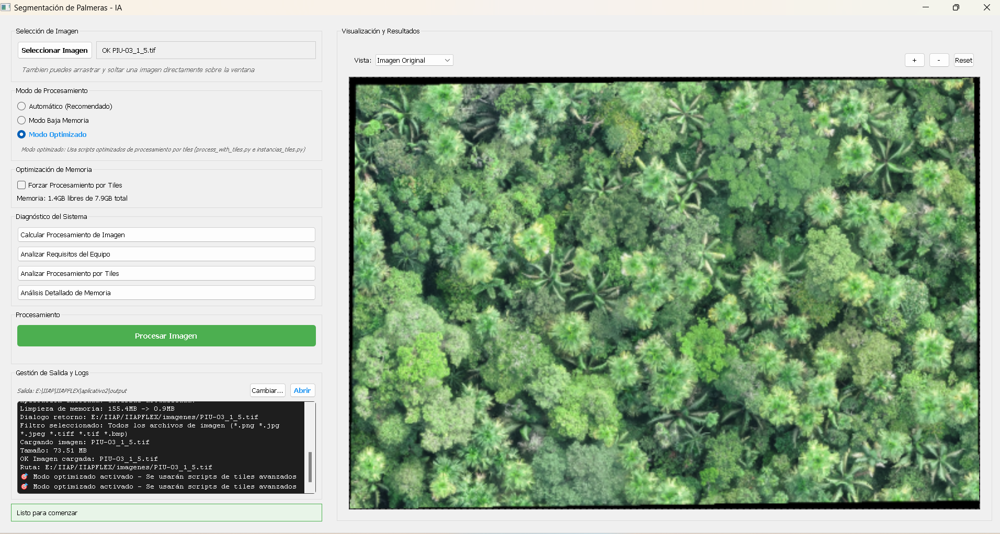

# PalmsCNN-Desktop-CLI 🚀


## 📋 Descripción

Este software es una solución de escritorio avanzada para el procesamiento de imágenes aéreas (ortomosaicos).

* **¿Qué problema resuelve?** Automatiza la detección, segmentación y conteo de tres especies de palmeras clave en la Amazonía, superando las limitaciones de memoria en computadoras convencionales al procesar imágenes de gran tamaño (GBs).
* **¿A quién va dirigido?** Investigadores del **Instituto de Investigaciones de la Amazonía Peruana (IIAP)**, ingenieros forestales y especialistas en monitoreo ambiental.
* **Contexto:** Desarrollado en **Iquitos, Perú**, como parte de una investigación para la cuantificación de recursos naturales mediante Inteligencia Artificial.

## ✨ Características Principales

* ✅ **Segmentación Semántica Multi-clase:** Identifica y diferencia entre *Mauritia flexuosa* (Aguaje), *Euterpe precatoria* (Huasaí) y *Oenocarpus bataua* (Ungurahui).
* ✅ **Gestión Eficiente de Memoria (Smart Tiling):** Divide imágenes gigantes en cuadrantes (tiles) con solapamiento inteligente y procesamiento por lotes (Batch Processing), permitiendo analizar GeoTIFFs pesados en PCs con 8-16GB de RAM.
* ✅ **Reportes Automáticos:** Genera vectores (`.gpkg`), centroides y tablas de atributos (`.csv`) con el conteo exacto y área de copa por especie.
* ✅ **Interfaz Gráfica (GUI):** Aplicación de escritorio amigable construida con PyQt5.

## 🛠️ Tecnologías Utilizadas

Este proyecto demuestra un dominio técnico avanzado en procesamiento geoespacial e IA:

* **Lenguaje:** Python 3.11
* **Interfaz:** PyQt5 (Qt Framework)
* **Motor de IA:** ONNX Runtime (Inferencia optimizada en CPU)
* **Librerías Geoespaciales:** GDAL / OGR (Core del procesamiento), Rasterio, Geopandas
* **Procesamiento Numérico:** NumPy (Uso de `memmap` para manejo de arrays en disco), Scikit-image, OpenCV

## 📊 Rendimiento del Modelo (IA)

El sistema utiliza una arquitectura de segmentación (DeepLabV3+) optimizada:

* **Modelo usado:** DeepLabV3+ (Backbone MobileNet/ResNet) convertido a ONNX.
* **Métricas estimadas:**
    * Precisión Global (Accuracy): > 90%
    * Intersección sobre Unión (IoU): > 85% en clase *Mauritia flexuosa*.
* **Dataset:** Imágenes de alta resolución recolectadas mediante drones en la Amazonía Peruana (Loreto).

## 📸 Capturas de Pantalla / Demo


*Vista de la aplicación procesando un ortomosaico con visualización de máscaras en tiempo real.*

## 🚀 Instalación y Uso

1.  **Clonar el repositorio:**
    ```bash
    git clone [https://github.com/iiap-gob-pe/PalmsCNN-Desktop-CLI.git](https://github.com/iiap-gob-pe/PalmsCNN-Desktop-CLI.git)
    ```

2.  **Instalar dependencias:**
    > **Nota:** Este proyecto requiere GDAL. Se recomienda usar el instalador `.whl` incluido en la carpeta `installers/` antes de ejecutar pip.
    
    ```bash
    # 1. Instalar núcleo GDAL (Windows)
    pip install installers/GDAL-3.6.4-cp311-cp311-win_amd64.whl
    
    # 2. Instalar resto de librerías
    pip install -r requirements.txt
    ```

3.  **Ejecutar:**
    ```bash
    python run.py
    ```

## 📄 Estructura del Proyecto

Organización modular siguiendo buenas prácticas de ingeniería de software:

```text
├── app/               # Código fuente de la GUI (PyQt5) y lógica de control
├── scripts/           # Scripts core de segmentación y conteo (Tiles, Watershed)
├── models/            # Modelos entrenados (.onnx)
├── installers/        # Binarios pre-compilados críticos (GDAL .whl)
├── output/            # Carpeta de generación de resultados
├── run.py             # Punto de entrada de la aplicación
└── Instalacion.ipynb  # Manual técnico detallado
